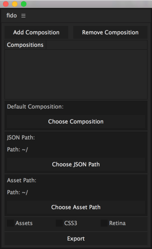

# fido
After Effects extension to export Compositions to JSON

##### Installation
* Copy *extension/fido.jsxbin* and paste into *Applications/Adobe After Effects/ScriptUI Panels*
* Open *After Effects > Preferences > General* and ensure *Allow Scripts to Write Files and Access Network* is checked

##### Instructions
* Open **Fido** in *Window > fido.jsxbin*
* Add Compositions by highlighting them in the **Project** panel and selecting **Add Composition**
* Remove Compositions by highlighting them in the **Project** panel and selecting **Remove Composition**
* **Default Composition** isn't required
* **JSON Path** is the location the JSON gets saved to
* **Asset Path** is the location assets are saved to, in their appropriate folders (assetPath/images, etc.)
* **Assets** checked will duplicate all used assets into the **Asset Path**
* **CSS3** will generate CSS3 animation
* **Retina** divides display/animation properties by 2 if checked. This is meant as an option if the designer has a retina screen and designs to those standards (ie. twice as big). This way the designer can design to retina and not lose quality.
