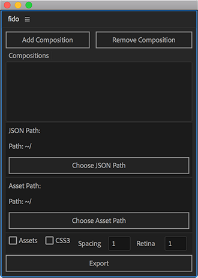

# fido
After Effects script to export Compositions to JSON

##### Installation
* Copy *script/fido.jsxbin* and paste into *Applications/Adobe After Effects/ScriptUI Panels*
* Open *After Effects > Preferences > General* and ensure *Allow Scripts to Write Files and Access Network* is checked

##### Instructions
* Open **Fido** in *Window > fido.jsxbin*
* Add Compositions by highlighting them in the **Project** panel and selecting **Add Composition**
* Remove Compositions by highlighting them in the **Project** panel and selecting **Remove Composition**
* **JSON Path** is the location the JSON gets saved to
* **Asset Path** is the location assets are saved to, in their appropriate folders (assetPath/images, etc.)
* **Assets** checked will duplicate all used assets into the **Asset Path**
* **CSS3** will generate CSS3 animation
* **Spacing** will divide text letter spacing to match device spacing
* **Retina** will scale the output (0.5 best for webgl, 1 for SVG)

##### To-Add
Currently effects with a `PropertyValueType.CUSTOM_VALUE` can't be exported for the following reason:
Currently blocked by AE: `"After Effects error: This propertyValueType CUSTOM_VALUE has not been implemented."`

If you have any requests for general Post Processing / Compositing effects, please request so via filing an issue :)

- [ ] Effects
    - [x] Brightness & Contrast
    - [ ] Curves (Blocked by `CUSTOM_VALUE`)
    - [x] Gaussian Blur
    - [ ] Hue/Saturation Effect (Blocked by `CUSTOM_VALUE`)
    - [ ] Levels (Blocked by `CUSTOM_VALUE`)
