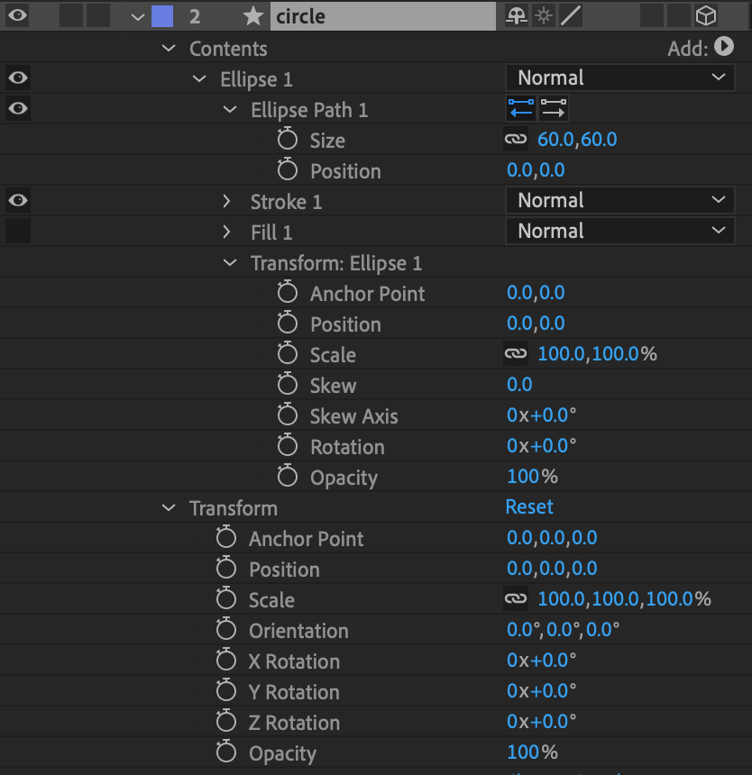

# Fido best-practices

After animating for years and working with many animators, I've learned everyone designs/animates differently.
That being said, you may notice some features will work for you, and some may act funny depending on how your structure is set up. Don't feel defeated, you just need to get the hang of things.

### Step 1

Create your Composition.
Typically I like to animate at 60 FPS because that's the framerate that looks the smoothest and the performance I like to maintain.

### Step 2

Create a Camera.
This is in case you're recreating your Composition in ThreeJS and wish to build the scene for you.
The "Angle of View" designates your "Field of View (FOV)", and will adjust the "Zoom" property of the camera for you.

### Step 3

Let's review the Camera we just made.
Since we're making a button Composition for this example and the aspect ratio is 1:1, the camera's position, zoom, and Depth of Field have been set to 86.6 for us by After Effects.

If you wish to animate the camera, keep in mind that in After Effects, the "Point of Interest" acts as the camera's target and will rotate the camera for you, so if you don't want this, you'll have to animate the Point of Interest values to match your position's X & Y values as well to avoid strange rotations.

### Step 4

Let's draw a Circle.
As you can see, After Effects has a lot of "Transform" objects, which act as Container objects to offset the position/rotation values to act as anchors. The best practice is to animate the closest Transform to the actual Shape (Ellipse, in this example), to avoid strange rotations in the future. Please note that the "Position" of the "Ellipse Path 1" is set to 0, 0 - This centers the Ellipse, as some drawing APIs do, such as WebGL & SVG (but not Canvas2D).

### Step 5

Stroke features, such as Trim.
Ensure that the "Trim" object is apart of the Shape itself, otherwise it won't know which Shape to effect.
